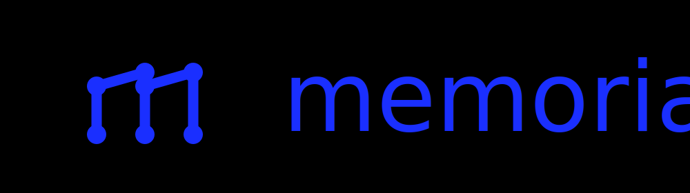

# Memoria — Personal Knowledge Base (PERN Stack)

*Memoria is a full-stack personal knowledge base application built with the PERN stack, enabling authenticated users to organise private notes into categories.*


[](https://github.com/ArekKrak/m50-memoria-pern)
[](https://memoria-app-tau.vercel.app)
[](https://memoria-api-0rtz.onrender.com)



This application was built as the **final open-ended PERN project** in the Codecademy *Full-Stack Web Development* path.

**Course Brief (summary):**
Design and build a full-stack PERN application from scratch using React, Node/Express, and PostgreSQL. Implement authentication, secure the application, write tests, and deploy the finished project.

---

## Overview

**Memoria** is a personal knowledge management system where users can create, organise, and manage private notes grouped into categories.

The platform supports:

Register → Login → Create Categories → Write Notes → Organise Knowledge

Each user's data is isolated and protected through authenticated session access.

---

## Architecture

```
Client (React + Vite)
			↓
Express REST API (Node.js)
			↓
PostgreSQL (Neon managed database)
```

Authentication uses:

- Passport Local Strategy (email + password)
- Google OAuth 2.0
- Secure session cookies

Deployment architecture:

- Frontend: Vercel
- Backend: Render
- Database: Neon PostgreSQL

---

## Backend

### Core Features

- User registration
- Secure password hashing with bcrypt
- Login with Passport Local Strategy
- Google OAuth authentication
- Session-based authentication
- Category CRUD
- Notes CRUD
- Ownership protection (users can only access their own data)
- RESTful API design

---

### Database Schema

Relational tables include:

- users
- categories
- notes

Relationships:

```
users
  ├── categories
  └── notes
```

Each category and note is tied to its owner through foreign-key constraints.

This ensures complete data isolation between users.

---

### API Highlights

Authentication:

- POST `/register`
- POST `/login`
- GET `/me`
- POST `/logout`
- GET `/auth/google`

Categories:

- GET `/categories`
- POST `/categories`
- DELETE `/categories/:id`

Notes:

- GET `/notes`
- POST `/notes`
- PUT `/notes/:id`
- DELETE `/notes/:id`

All category and note routes are protected by authentication middleware.

---

## Frontend

### Features

- Account registration
- Login with email/password
- Google OAuth login
- Category creation
- Notes creation
- Editing notes
- Deleting notes
- Assigning notes to categories
- Filtering notes by category
- Session persistence
- Route protection for authenticated pages

The interface dynamically adapts depending on authentication state.

---

## Project Structure

```
m50-memoria-pern/
├── backend/
│   ├── src/
│   │   ├── auth/
│   │   │   └── google.js
│   │   ├── middleware/
│   │   │   ├── requireAuth.js
│   │   │   └── validate.js
│   │   ├── routes/
│   │   │   ├── auth.routes.js
│   │   │   ├── categories.routes.js
│   │   │   └── notes.routes.js
│   │   ├── db.js
│   │   └── session.js
│   ├── test/
│   │   └── app.test.js
│   ├── app.js
│   ├── .gitignore
│   ├── index.js
│   └── package.json
│
├── frontend/
│   ├── public/
│   │   ├── banner.svg
│   │   ├── memoria_logo.png
│   │   └── memoria_logo.svg
│   ├── src/
│   │   ├── components/
│   │   │   ├── Navbar.css
│   │   │   └── Navbar.jsx
│   │   ├── pages/
│   │   │   ├── CreateNote.jsx
│   │   │   ├── Dashboard.css
│   │   │   ├── Dashboard.jsx
│   │   │   ├── Dashboard.test.jsx
│   │   │   ├── EditNote.jsx
│   │   │   ├── Home.css
│   │   │   ├── Home.jsx
│   │   │   ├── Home.test.jsx
│   │   │   ├── Login.css
│   │   │   ├── Login.jsx
│   │   │   ├── Login.test.jsx
│   │   │   ├── Register.css
│   │   │   └── Register.jsx
│   │   ├── App.css
│   │   ├── App.jsx
│   │   ├── index.css
│   │   ├── main.jsx
│   │   └── setupTests.jsx
│   ├── .gitignore
│   ├── index.html
│   └── package.json
│
└── README.md
    
```

---

## Testing

### Backend

Mocha tests verify:

- authentication security
- route protection
- input validation

Run tests:

```
cd backend
npm test
```

---

### Frontend

Vitest tests verify:

- page rendering
- component behaviour

Run tests:

```
cd frontend
npm test
```

---

## Deployment

The application is deployed across three services:

Frontend

- Vercel static hosting
- Global CDN delivery

Backend

- Render Node.js service
- Session authentication enabled

Database

- Neon managed PostgreSQL

Production configuration includes:

- secure cookies
- CORS configuration
- environment-based secrets

---

## Key Engineering Decisions

### Session Authentication

Chose session-based authentication instead of JWT to leverage HTTP-only cookies and simplify secure logout behaviour.

### Relational Schema

Foreign keys enforce strict ownership relationships between users, categories, and notes.

### Clear API Boundaries

Separated authentication, category, and notes routes to maintain clean modular architecture.

### Cross-Origin Deployment

Configured CORS and cookie security settings to allow the Vercel frontend to communicate with the Render backend safely.

---

## Technical Highlights

- Full PERN stack implementation
- Session-based authentication with Passport
- Google OAuth integration
- Secure password hashing
- Protected API routes
- Category-based note organisation
- Cross-origin production deployment
- Backend and frontend test coverage

---

## Limitations

- No note search functionality
- No markdown support
- No note sharing between users
- No tagging system

---

## Future Improvements

- Markdown support for notes
- Full-text search
- Tag-based organisation
- Rich text editor
- Offline support
- Mobile UI improvements

---

## Live Deployment

[Client](https://memoria-app-tau.vercel.app/ "Memoria Client")

[API](https://memoria-api-0rtz.onrender.com/ "Memoria Server")

---

## Contact
If you're a recruiter, mentor, or fellow developer interested in collaboration or feedback:

**Arek Krakowiak**
[krak.arek@protonmail.com](mailto:krak.arek@protonmail.com)

---

Thank you for viewing this project!
